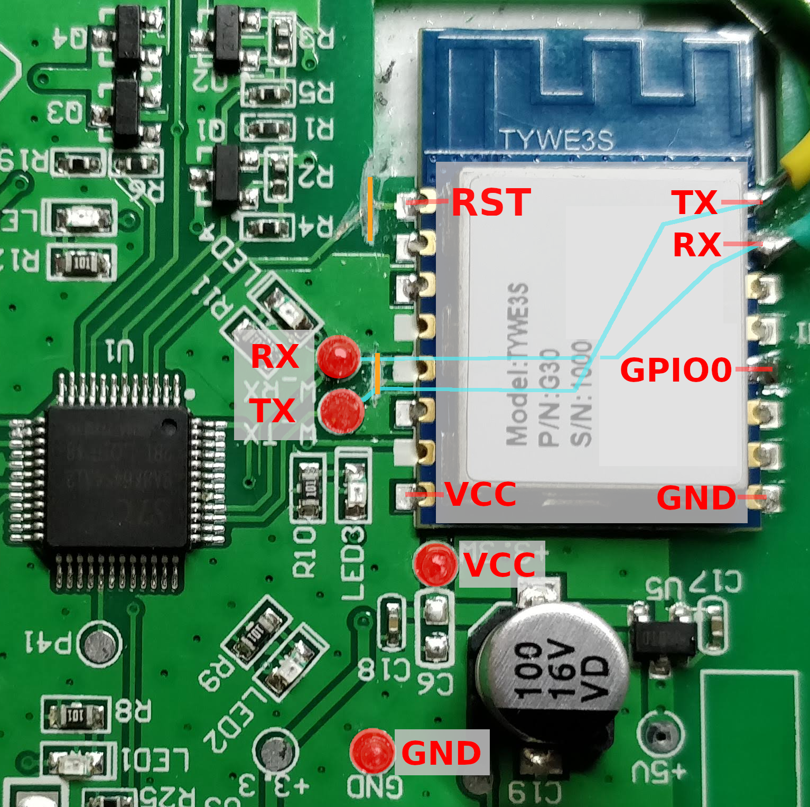
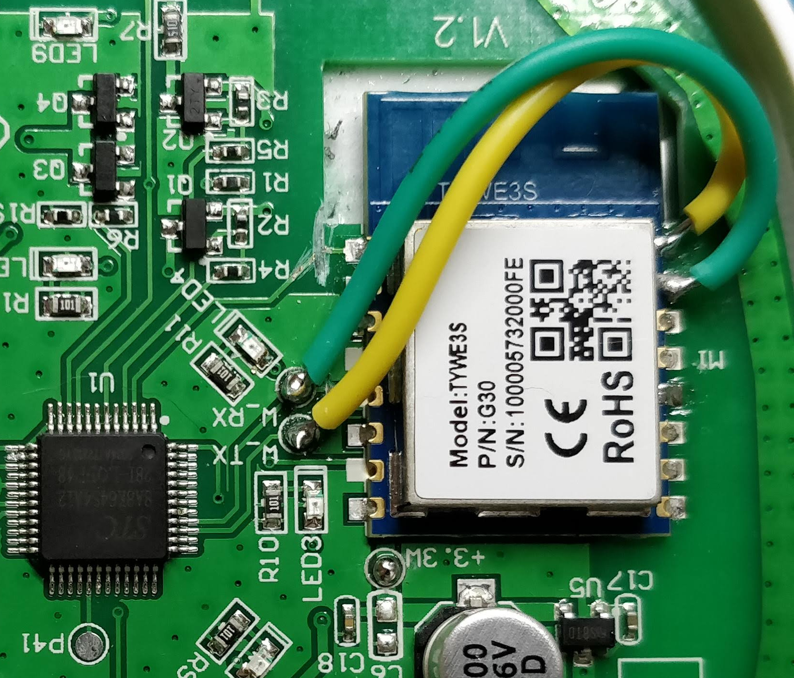

# How to flash the Tuya Wi-Fi alarm siren

The ESP8266 (TYWE3S) can be flashed with no problem once you cut the communication with the Tuya MCU. This step is needed because the UART port used for flashing is the same the ESP8266 uses to communicate with the Tuya MCU. So, as long as the Tuya MCU is powered on, you can't flash the ESP8266.

One easy solution I've found was to cut the UART PCB tracks (RX and TX). Once the ESP8266 is flashed, just rebuild the tracks by soldering two wires.

I've cutted the RST track too, because the Tuya MCU may use this pin to reboot the ESP8266 if it is not responding.

## What you need
  * Soldering iron + solder
  * Cutter
  * Dupont jumper cables
  * USB-TTL module (e.g. FT232RL, CP2102, etc)
  * Patience

## Preparation

  1. Make sure it is unplugged and the battery switch is turned off.
  2. Cut RX/TX PCB tracks using a cutter (lower orange line).
  3. Cut RST PCB track using a cutter (upper orange line)
  4. Solder wires to TX, RX, VCC, GND and GPIO0 (I use male-female dupont wires). Use the TX/RX points on the TYWE3S module, not the marked points on the left side of the module. For VCC and GND you can use those on the module or the marked alternative points on the PCB.
  5. Connect the wires to the USB-TTL module. The ESP8266 uses 3.3V, don't connect it to 5V.

USB-TTL | TYWE3S
------------ | -------------
VCC 3.3V | VCC
GND      | GND
TX       | RX
RX       | TX
GND      | GPIO0

You can leave GPIO0 connected to GND during the whole process.

## Backup original firmware

For this task I use [esptool](https://github.com/espressif/esptool)

```bash
$ esptool.py -p /dev/ttyUSB0 read_flash 0 0x200000 orig_firm_1.bin
$ esptool.py -p /dev/ttyUSB0 read_flash 0 0x200000 orig_firm_2.bin
$ md5sum orig_firm_*
```

I always do a couple of backups and compare the hashes. If both have the same hash, everything was OK. Otherwise, do another backup.

## Build with ESPHome

I use the docker image method because it does not need any setup steps. If you want to use other build method, please refer to [ESPHome build guides](https://esphome.io/guides/contributing.html#build)

Create the `secrets.yaml` file with the required configuration variables for your configuration.
```yaml
wifi_ssid: MY_WIFI_NAME
wifi_pass: my_wifi_password

mqtt_ip: 192.168.0.11
mqtt_port: 1883
mqtt_user: mqtt_user
mqtt_pass: mqtt_user_pass

ota_password: some_random_password_or_string
```

Build and run

```bash
$ docker run --rm -v "${PWD}:/config" --device /dev/ttyUSB0 -it esphome/esphome:1.15.3 wifi_alarm.yaml run
```

## Rebuild tracks

Now, the ESP8266 is flashed, but it is not able to communicate with the Tuya MCU. To restore communication between modules, you have to rebuild the tracks you cut on the preparation steps. Luckily, there are a couple of solder points that make this task quite easy.

<a href="./rebuilt_tracks.jpg"></a>

Now the ESP8266 should be able to connect to your Wi-Fi network  and MQTT server.

Note that you can update it via the [ESPHome OTA update component](https://esphome.io/components/ota.html).

# Bonus track (development)
If you want to develop and test, I recommend to use an ESP32 dev board. This way you can use an UART port for flashing and debugging, and another UART port to communicate with the Tuya MCU. I have left the file `wifi_alarm_dev.yaml` as a reference.

Another recommendation is to unsolder the buzzer, as it will drive you crazy from second 1.